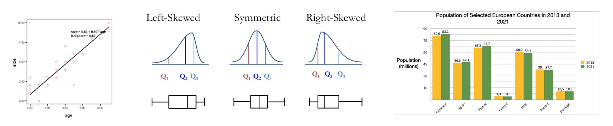
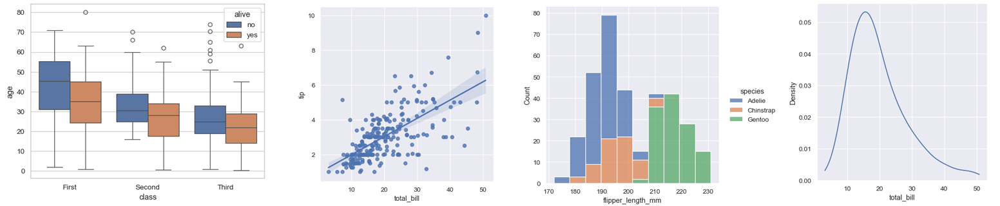
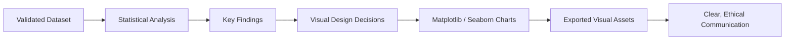

# Module 12 — Data Visualisation with Matplotlib and Seaborn

**Session Time:** 120 minutes

---

## Prerequisites

- Python fundamentals (functions, conditionals)
- Working with Pandas DataFrames
- Exploratory Data Analysis (EDA)
- Correlation and regression analysis (Module 11)
- Completion of **Module 11 — Statistical Analysis and Inference**

---

## Session Breakdown

| Segment | Topic                                                     | Duration (minutes) |
|-------:|-----------------------------------------------------------|--------------------|
| 1      | From Statistical Results to Visual Communication          | 10                 |
| 2      | Visualisation Fundamentals & Design Principles            | 20                 |
| 3      | Creating Charts with Matplotlib                           | 25                 |
| 4      | Enhancing Visuals with Seaborn                             | 25                 |
| 5      | Critiquing, Exporting, and Versioning Visual Assets        | 10                 |
|        | **Lab — Visualising Data with Matplotlib & Seaborn**      | **30**             |

---

## Learning Objectives

By the end of this module, you'll be able to:

- Create and customise **data visualisations** using Matplotlib and Seaborn  
- Select **appropriate chart types** to communicate analytical findings  
- Apply **visual design principles** for clarity and interpretability  
- Export and version visual assets for **reporting and reuse**  
- Critically evaluate visualisations for **clarity, bias, and misinterpretation**

---

## What You Will Learn

In this module, you move from **statistical insight** to **visual storytelling**.

After identifying relationships through correlation and regression (Module 11), analysts must communicate findings in a way that is:

- Clear  
- Honest  
- Interpretable  
- Fit for the audience  

You will learn how to **translate analytical results into effective visuals** that support reasoning, decision-making, and communication.

---

## From Inference to Communication

Statistical outputs are rarely consumed directly by stakeholders.

This module focuses on:

- Turning coefficients and relationships into visuals  
- Supporting interpretation without distortion  
- Avoiding misleading or ambiguous charts  

Good visualisation does not decorate analysis — it **clarifies it**.

---
## Why Visualisation Matters

Visuals help answer questions such as:

- Is the relationship linear or non-linear?
- Are there outliers influencing interpretation?
- How do groups compare at a glance?
- Does the statistical result “make sense” visually?

A strong visual can **confirm**, **challenge**, or **refine** statistical conclusions.

### Examples of Visual Support

---

## Visualisation Fundamentals & Design Principles

Before plotting, analysts must make **intentional design decisions**.

Key principles include:

- Choosing the right chart for the question  
- Clear axis labels and titles  
- Appropriate scaling and ranges  
- Meaningful use of colour  
- Removing unnecessary visual clutter  

Visualisation is an **analytical decision**, not just a technical one.

---

## Creating Visuals with Matplotlib

Matplotlib provides low-level control over visual output.

In this module, you will learn to:

- Create bar charts, line plots, histograms, and scatter plots  
- Control figure size, layout, and labels  
- Layer information (e.g. trend lines, annotations)  
- Export figures as reusable assets  

Matplotlib is ideal when **precision and control** are required.

---

## Enhancing Visuals with Seaborn

Seaborn builds on Matplotlib to simplify statistical visualisation.

Using Seaborn, you can:

- Create distribution plots and boxplots  
- Compare groups using colour and layout  
- Quickly generate aesthetically consistent charts  

Seaborn helps you focus on **insight**, not styling boilerplate.

---

## From Statistical Output to Visual Narrative

Visuals should align with analytical intent:

- Correlation → scatter plots  
- Regression → scatter + fitted line  
- Group comparison → bar charts or boxplots  
- Distribution → histograms or KDE plots  

Each visual should answer a **specific analytical question**.

---

## Critiquing and Refining Visualisations

Not all charts are good charts.

You will learn to ask:

- Is the message clear at a glance?
- Could this visual mislead interpretation?
- Are design choices exaggerating or hiding patterns?
- Is this appropriate for a non-technical audience?

Critical review is part of ethical data practice.

---

## Exporting and Versioning Visual Assets

Professional workflows require reproducibility.

In this module, you will:

- Export figures as PNG files  
- Use descriptive filenames  
- Store visuals in structured folders  
- Version assets alongside notebooks  

This supports reuse in reports, presentations, and dashboards.

---

## Conceptual Visual Analytics Workflow

---
## AI Reflection Prompt

Before starting the lab, use an AI assistant of your choice and ask:

> **“What makes a data visualisation misleading, even when the data itself is correct?”**

As you review the response, reflect on:

- How design choices influence interpretation  
- Which risks you must actively avoid  
- How clarity supports ethical communication  

Keep these reflections in mind as you design and critique your charts in the lab.

---

## Wrap-Up Reflection

- Why is visualisation a critical step after statistical analysis?  
- How can visuals both support and distort analytical conclusions?  
- What responsibilities do analysts have when presenting data visually?  
- How does exporting and versioning visuals improve professional workflows?  

---

## Resources

- **Matplotlib Documentation**  
  https://matplotlib.org/stable/

- **Seaborn Documentation**  
  https://seaborn.pydata.org/

- **Pandas User Guide — Visualization**  
  https://pandas.pydata.org/docs/user_guide/visualization.html

- **Data Visualization Best Practices**  
  https://www.data-to-viz.com/

- **Storytelling with Data**  
  https://www.storytellingwithdata.com/
