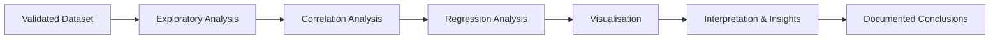

# Module 10 — Exploring Relationships: Correlation & Regression Analysis

**Session Time:** 120 minutes

---

## Prerequisites

- Python fundamentals (functions, conditionals)
- Working with Pandas DataFrames
- Data validation and quality assurance practices
- Basic exploratory data analysis (EDA)
- Completion of **Module 9 — Data Validation and Quality Assurance**

---

## Session Breakdown

| Segment | Topic                                                   | Duration (minutes) |
|-------:|---------------------------------------------------------|--------------------|
| 1      | From Clean Data to Analytical Questions                 | 10                 |
| 2      | Exploring Relationships with Pandas                     | 20                 |
| 3      | Correlation Analysis                                    | 20                 |
| 4      | Introduction to Regression Analysis                     | 20                 |
| 5      | Interpreting Results & Communicating Insights           | 20                 |
|        | **Lab — Correlation & Regression Analysis**             | **30**             |

---

## Learning Objectives

By the end of this module, you'll be able to:

- Explore datasets to identify **trends, relationships, and outliers** using Pandas  
- Apply **correlation analysis** to assess relationships between variables  
- Perform and interpret **simple regression analysis**  
- Summarise findings using **descriptive statistics and visual exploration**  
- Communicate analytical insights clearly using **markdown, plots, and written interpretation**

---

## What You Will Learn

In this module, you move from **validated data** to **interpreted relationships**.

Once data quality is assured, analysts can confidently ask deeper questions such as:

- Are two variables related?
- How strong is that relationship?
- Is the relationship positive, negative, or negligible?
- Can one variable help explain or predict another?

You’ll learn how to **explore, quantify, and communicate relationships in data**, laying the foundation for predictive modelling and evidence-based decision-making.

---

## From Validation to Insight

After Module 9, you should be working with datasets that are:

- Clean  
- Validated  
- Documented  

Module 10 builds on this foundation by focusing on **analytical reasoning** rather than data fixing.

Here, the goal is not just *calculating numbers*, but **interpreting what those numbers mean** in context.

---

## Exploring Relationships with Pandas

Pandas provides powerful tools to explore how variables behave together.

You can:

- Compare distributions across variables  
- Identify trends and patterns  
- Detect potential outliers visually and numerically  
- Compute summary statistics to support interpretation  

Exploration helps you decide **which relationships are worth analysing further**.

---

## Correlation Analysis

Correlation measures the **strength and direction** of a relationship between two variables.

Using Pandas, you can:

- Compute correlation coefficients (e.g. Pearson correlation)
- Compare multiple variables using correlation matrices
- Identify strong, weak, positive, or negative relationships

> ⚠️ Correlation does **not** imply causation — interpretation matters.

---

## Introduction to Regression Analysis

Regression analysis helps you model the relationship between variables.

In this module, you’ll focus on:

- Simple linear regression concepts  
- Understanding dependent vs independent variables  
- Interpreting regression outputs conceptually  
- Using regression as an explanatory (not predictive) tool  

Regression provides a structured way to **quantify relationships** and assess how changes in one variable relate to another.

---

## Interpreting Results and Communicating Insights

Numbers alone are not insights.

Strong analysis includes:

- Clear interpretation of results  
- Visual support (plots, trends, patterns)  
- Written explanations in markdown  
- Acknowledgement of assumptions and limitations  

This module emphasises **analytical storytelling** — explaining *what the data says* and *why it matters*.

---

## Conceptual Analysis Workflow

## AI Reflection Prompt

Before starting the lab, use an AI assistant of your choice and ask:

> **“When is correlation analysis insufficient, and why might regression provide deeper insight?”**

As you review the response, reflect on:

- What kinds of questions correlation can answer  
- What additional insight regression might provide  
- The risks of over-interpreting relationships  
- How analytical context influences interpretation  

Keep these reflections in mind as you work through the lab.

---

## Wrap-Up Reflection

- Why is validated data essential before correlation or regression analysis?
- How can visual exploration support or challenge numerical results?
- What are the risks of misinterpreting correlation or regression outputs?
- How does clear documentation improve analytical credibility?

---

## Resources

- **Pandas Documentation**  
  https://pandas.pydata.org/docs/

- **Pandas User Guide — Visualization**  
  https://pandas.pydata.org/docs/user_guide/visualization.html

- **Correlation and Regression (Conceptual Overview)**  
  https://www.statisticshowto.com/probability-and-statistics/correlation-analysis/

- **Real Python — Correlation & Regression with Pandas**  
  https://realpython.com/pandas-correlation-regression/
