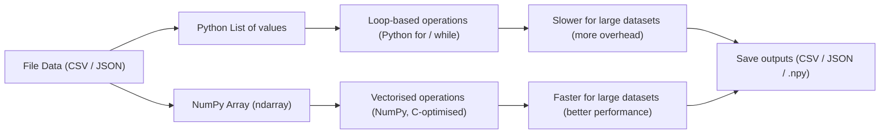

# Module 4 — File Formats and Data I/O

## Module Overview

In this module, you will learn how data moves **into and out of Python**.

You’ll work with common file formats used in real-world analytics projects and practise reading, writing, and combining datasets in a **reproducible and memory-aware way**. You’ll also begin using **NumPy** for efficient numerical computing, applying vectorised operations to improve performance when working with array-based data.

These skills are essential for building reliable, scalable data analysis workflows.

---

## Learning Objectives

By the end of this module, you will be able to:

- Load and save data using common file formats such as CSV, JSON, and NumPy arrays
- Use NumPy arrays for numerical computation and vectorised operations
- Compare Python lists and NumPy arrays for performance and use cases
- Combine file-based data loading with efficient numerical processing
- Apply best practices for reproducible data input/output workflows

---

## Session Breakdown

| Segment | Topic | Duration (minutes) |
|-------|------|--------------------|
| 1 | Understanding Data I/O and File Formats | 20 |
| 2 | Working with CSV and JSON Data | 20 |
| 3 | Introduction to NumPy Arrays | 20 |
| 4 | Vectorised Operations and Performance | 20 |
| 5 | Lab: Loading and Processing Data with NumPy | 30 |
| 6 | Wrap-Up and Reflection | 10 |

---

## 1. Understanding Data I/O and File Formats

Data analysis begins with **reading data from files** and ends with **writing results back to disk**.

Common file formats you’ll encounter include:

- **CSV** — simple, tabular data
- **JSON** — structured, nested data
- **NumPy binary formats** — efficient storage for numerical arrays

Choosing the right format depends on:
- Data size
- Structure
- Performance requirements
- Reproducibility needs

---

## 2. Working with CSV and JSON Data

Python provides multiple ways to read and write structured data.

### Reading a CSV file
```python
import csv

with open("data.csv", newline="") as file:
    reader = csv.reader(file)
    for row in reader:
        print(row)
```
### Reading a JSON file
```python
import json

with open("data.json") as file:
    data = json.load(file)
```
---
### Why Understanding File Formats Matters

Understanding file formats helps you:

- Inspect raw data
- Validate data structure
- Prepare data for numerical analysis
  
---

## 3. Introduction to NumPy Arrays

NumPy is a core library for numerical computing in Python and is widely used in data analytics, data science, and machine learning workflows.

Unlike Python lists, NumPy arrays:

- Store data more efficiently
- Support fast, vectorised operations
- Are optimised for mathematical computation
  
---

The diagram below illustrates the key conceptual difference between working with Python lists and NumPy arrays.

### NumPy vs Python Lists (Conceptual Model)


---
## 4. Vectorised Operations and Performance

Vectorised operations allow NumPy to apply calculations to entire arrays at once, without explicit loops.

```python
import numpy as np

values = np.array([10, 20, 30, 40])
normalized = values / values.max()
```
Compared to Python loops, vectorised code is:

- Faster  
- More readable  
- Less error-prone  

This is especially important when working with large datasets, where performance and clarity directly impact analytical efficiency.

---

## 🤖 LLM Checkpoint — Understanding NumPy Performance (Optional)

Efficient numerical computation is a key requirement in data analytics and machine learning workflows.  
This checkpoint uses an LLM to support conceptual understanding, which you will then validate using Python.

### Step 1: Query the LLM

Use an LLM (for example, ChatGPT) and submit the following prompt:

**Prompt:**
> Why are NumPy arrays typically faster than Python lists for numerical operations?  
> Provide **three concise reasons** and **one example** of a vectorised operation.

---

### Step 2: Validate the Explanation

Review the response and identify **one claim** that can be tested in code.

Then, validate that claim by writing and running a short Python example.

**Suggested comparison:**
- A loop-based operation using a Python list  
- A vectorised operation using a NumPy array

---

### Learning Outcome

This exercise reinforces an important professional workflow:

- Use LLMs to accelerate understanding and exploration  
- Rely on code execution to verify correctness and performance

In practice, analytical decisions should always be supported by measurable results.

---
## 5. Reproducible Data I/O Workflows

Professional data projects follow consistent structures to ensure reproducibility:

```text
project-name/
│
├── data/
│   ├── raw/
│   └── processed/
├── notebooks/
│   └── analysis.ipynb
├── src/
│   └── io_utils.py
└── README.md
```
Separating raw data, processed outputs, and code helps keep projects clean, transparent, and maintainable.

---
## Lab Preview — Loading and Processing Data with NumPy

In the lab that follows this module, you will:

- Load data from CSV and JSON files
- Convert raw data into NumPy arrays
- Apply vectorised calculations for analysis
- Save processed outputs back to disk
- Organise your project using a reproducible folder structure

This lab will reinforce how file formats and numerical computing work together in real analytics workflows.

---

## Wrap-Up Reflection

- Why is NumPy more efficient than Python lists for numerical data?
- How do file formats influence performance and reproducibility?
- When should raw data be kept separate from processed data?

---

## Resources

- NumPy Documentation: https://numpy.org/doc/
- Python File I/O: https://docs.python.org/3/tutorial/inputoutput.html
- CSV Module: https://docs.python.org/3/library/csv.html
- JSON Module: https://docs.python.org/3/library/json.html

