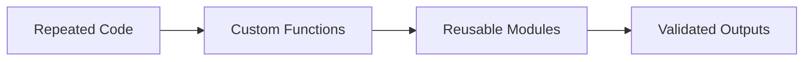

# Module 3: Functions and Data Structures

## Module Overview

In this module, you’ll build modular and reusable Python code using custom functions and core data structures. You’ll apply Pandas at an introductory level to clean, transform, and structure small datasets, handling missing values and simple outliers to produce analysis-ready data. The focus is on writing reusable logic, validating outputs, and preparing code for scalable analytics workflows.

---

## Learning Objectives

By the end of this module, you will be able to:

- Define and reuse custom Python functions to modularise analytical code  
- Manipulate Python data structures to manage and validate structured data  
- Apply Pandas for basic data cleaning and transformation tasks  
- Validate outputs using assertions and simple checks  
- Refactor repetitive logic into reusable functions
- Version reusable scripts using Git and GitHub  

---

## Session Breakdown

| Segment | Topic | Duration (minutes) |
|--------|-------|--------------------|
| 1 | Why Functions and Modular Code Matter | 20 |
| 2 | Defining and Reusing Functions | 25 |
| 3 | Data Structures for Structured Data | 25 |
| 4 | Intro to Pandas for Function-Based Data Cleaning | 30 |
| 5 | Validation, Refactoring, and Lab Overview | 20 |

---

## 1. Why Modular Code Matters

As analytical workflows grow, copy-pasting code quickly becomes error-prone and hard to maintain. Functions allow you to:

- Encapsulate logic in reusable blocks  
- Apply the same operation consistently across datasets  
- Debug and test code more effectively  
- Scale analysis without duplication  

### From Linear Code to Reusable Functions


## 2. Defining and Reusing Functions

Functions allow you to define a task once and reuse it multiple times.

```python
def calculate_mean(values):
    return sum(values) / len(values)
```
Well-designed functions:

- Perform one clear task  
- Accept inputs as parameters  
- Return outputs explicitly
---
## 3. Python Data Structures for Structured Data

Python provides built-in data structures to organise and validate data:

- **Lists** for ordered collections  
- **Dictionaries** for labelled data  
- **Tuples** for fixed collections  

Example:

```python
record = {
    "name": "Sample A",
    "value": 42,
    "valid": True
}
```
These structures are often used inside functions to process structured records.

---

## 4. Introducing Pandas for Function-Based Data Cleaning

In this module, you’ll start working with **Pandas**, one of the most widely used Python libraries for data analysis.

Pandas provides powerful tools to:
- Load and inspect datasets  
- Clean and transform structured data  
- Handle missing values and simple outliers  
- Prepare data for analysis and reuse  

At this stage, Pandas is introduced as a **supporting tool used inside functions**, rather than as a full data-wrangling framework. The goal is to combine Pandas operations with reusable functions to keep analytical code clean, modular, and maintainable.

---

### Installing Pandas (if needed)

If Pandas is not already installed in your environment, you can install it using one of the following methods.

Using `pip`:

```bash
pip install pandas
```
Or, if you are using Anaconda:

```bash
conda install pandas
```
---
### Using Pandas Inside Functions

```python
import pandas as pd

def clean_missing_values(df):
    return df.dropna()
```
In this module, Pandas is used to support function-based data cleaning by allowing you to:

- Load small, structured datasets into DataFrames  
- Apply simple and readable cleaning operations (such as removing missing values)  
- Encapsulate Pandas logic inside reusable Python functions  
- Return clean, analysis-ready outputs that can be reused across projects  
---
## 5. Validation and Assertions

Assertions help ensure your functions behave as expected.

```python
def normalize_values(values):
    assert len(values) > 0, "Input list must not be empty"
    return [v / max(values) for v in values]
```
Assertions support:

- Early error detection  
- Clear debugging messages  
- More reliable analytical code
---
## Versioning Reusable Code with Git

Reusable functions should be versioned like any other professional code.

```bash
git add .
git commit -m "Add reusable data cleaning functions"
```
Version control ensures your analytical logic remains transparent, traceable, and reproducible.

---
## Wrap-Up Reflection

- Why are functions essential for scalable data workflows?  
- How do data structures support validation and organisation?  
- Why is it important to validate outputs before analysis?  

---

## Resources

- **Python Functions Documentation**: https://docs.python.org/3/tutorial/controlflow.html#defining-functions  
- **Pandas Documentation (Intro)**: https://pandas.pydata.org/docs/  
- **Real Python – Functions**: https://realpython.com/defining-your-own-python-function/  
- **GitHub Documentation**: https://docs.github.com  
