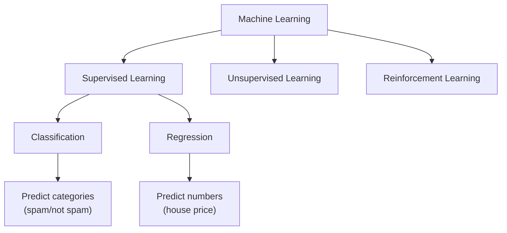
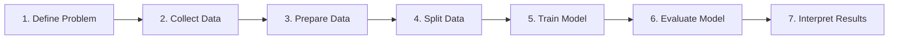
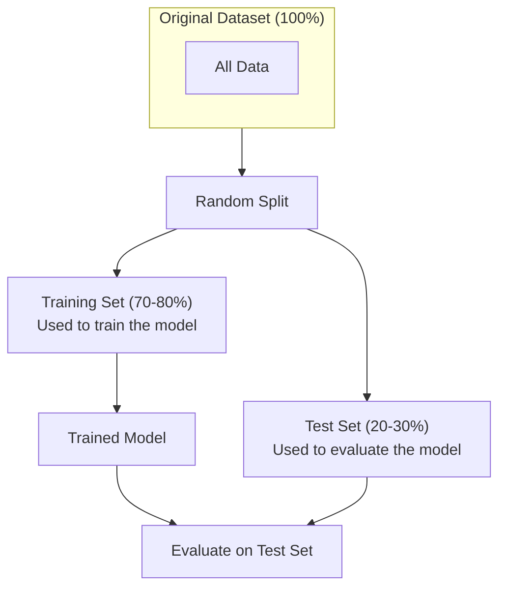
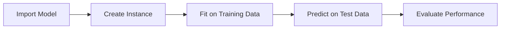
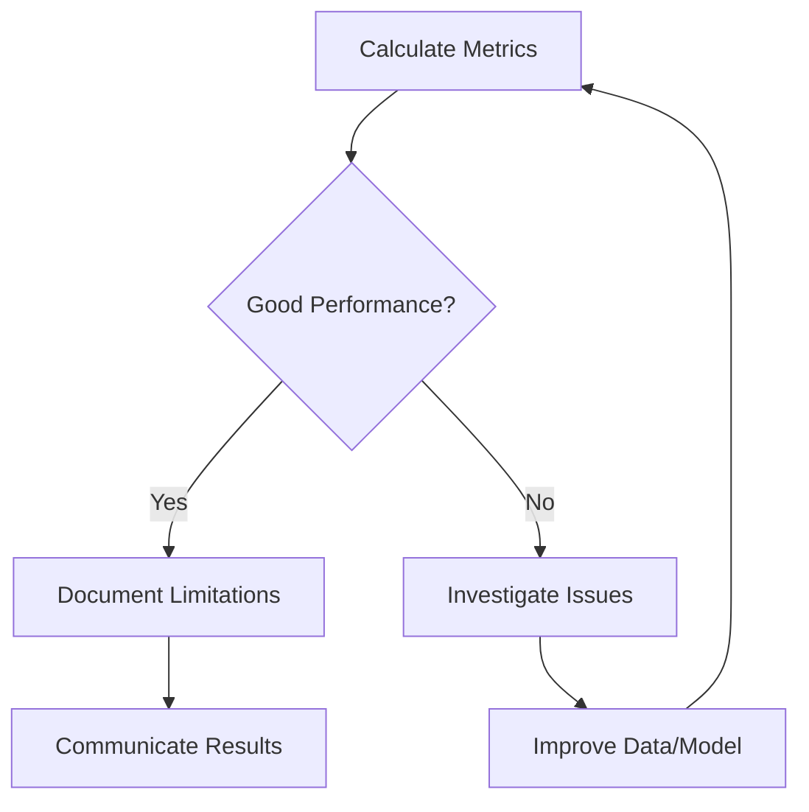
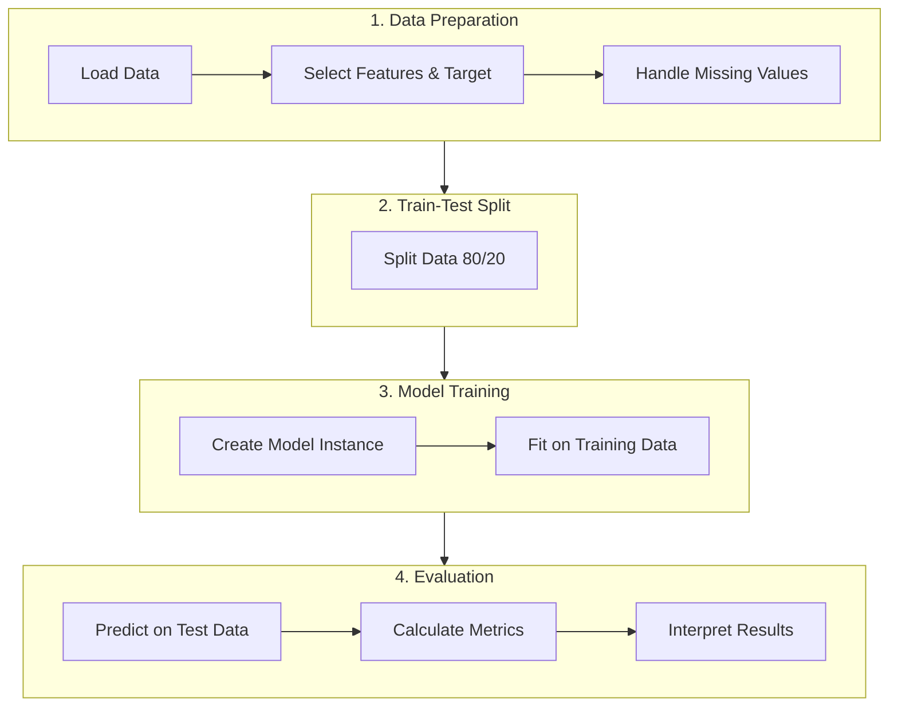

# Module 14 — Introduction to Machine Learning with Scikit-Learn

**Session Time:** 120 minutes

---

## Prerequisites

- Python fundamentals (functions, conditionals)
- Working with Pandas DataFrames and NumPy arrays
- Exploratory Data Analysis (EDA)
- Basic statistical reasoning (correlation, regression)
- Data visualization with Matplotlib and Seaborn
- Completion of **Module 13 — Time Series and Forecasting**

---

## Session Breakdown

| Segment | Topic                                              | Duration (minutes) |
|--------:|----------------------------------------------------|--------------------|
| 1       | What is Machine Learning?                          | 15                 |
| 2       | The Machine Learning Workflow                      | 15                 |
| 3       | Splitting Data: Training and Test Sets             | 20                 |
| 4       | Building a Baseline Model with Scikit-Learn        | 20                 |
| 5       | Evaluating Model Performance                       | 20                 |
|         | **Lab — Building and Evaluating a Baseline Model** | **30**             |

---

## Learning Objectives

By the end of this module, you'll be able to:

- Split data into training and test sets and fit a baseline model using Scikit-Learn
- Evaluate model performance using accuracy or RMSE metrics
- Interpret results and communicate model limitations in context

---

## Tools

- Python 3
- Jupyter Notebook
- Scikit-Learn
- Pandas
- NumPy

---

## Module Overview

Build and evaluate a baseline predictive model using Scikit-Learn, interpreting performance metrics and recognizing model limitations.

---

## What You Will Learn

In this module, you transition from analyzing historical data to making predictions about future outcomes.

Machine learning enables computers to learn patterns from data without being explicitly programmed for every scenario.

You will learn how to:

- Understand the fundamental concepts of supervised learning
- Prepare data for machine learning by splitting it appropriately
- Train a baseline predictive model using Scikit-Learn
- Evaluate model performance with appropriate metrics
- Recognize and communicate the limitations of your model

The goal is not to build the most complex model, but to understand the foundations of predictive modeling.

---

## What is Machine Learning?

Machine learning is a subset of artificial intelligence where algorithms learn patterns from data to make predictions or decisions.

### Types of Machine Learning



In this module, we focus on **supervised learning**, where:

- The algorithm learns from labeled examples
- Each example has input features and a known output (target)
- The goal is to predict outputs for new, unseen data

### Classification vs Regression

| Type | Output | Example | Metric |
|------|--------|---------|--------|
| Classification | Category/Label | Email spam detection | Accuracy |
| Regression | Continuous number | House price prediction | RMSE |

---

## The Machine Learning Workflow

Every machine learning project follows a similar workflow:



### Key Stages Explained

1. **Define Problem** — What are you trying to predict? Is it classification or regression?

2. **Collect Data** — Gather relevant data with features and target variable

3. **Prepare Data** — Clean, transform, and select features

4. **Split Data** — Separate data into training and test sets

5. **Train Model** — Fit the model on training data

6. **Evaluate Model** — Measure performance on test data

7. **Interpret Results** — Understand what the model learned and its limitations

---

## Splitting Data: Training and Test Sets

### Why Split Data?

The fundamental question in machine learning:

> "Will my model work on data it has never seen before?"

If we train and evaluate on the same data, we cannot answer this question.

### The Train-Test Split



### Key Principles

- **Training set** — The model learns patterns from this data
- **Test set** — The model is evaluated on this data (never seen during training)
- **Never use test data for training** — This would give an unrealistic view of model performance

### Using Scikit-Learn's train_test_split

```python
from sklearn.model_selection import train_test_split

# X = features, y = target variable
X_train, X_test, y_train, y_test = train_test_split(
    X, y, 
    test_size=0.2,      # 20% for testing
    random_state=42     # For reproducibility
)
```

### Important Parameters

| Parameter | Description | Common Values |
|-----------|-------------|---------------|
| `test_size` | Proportion of data for testing | 0.2 (20%) or 0.3 (30%) |
| `random_state` | Seed for reproducibility | Any integer (e.g., 42) |
| `stratify` | Maintains class proportions (classification) | `y` for classification tasks |

---

## Building a Baseline Model with Scikit-Learn

### What is Scikit-Learn?

Scikit-Learn is Python's most popular machine learning library. It provides:

- Consistent API across all algorithms
- Tools for data preprocessing
- Model training and evaluation utilities
- Wide range of algorithms

### The Scikit-Learn API Pattern

All Scikit-Learn models follow the same pattern:



```python
# 1. Import the model
from sklearn.linear_model import LinearRegression

# 2. Create an instance
model = LinearRegression()

# 3. Fit on training data
model.fit(X_train, y_train)

# 4. Predict on test data
y_pred = model.predict(X_test)

# 5. Evaluate performance
# (covered in next section)
```

### Baseline Models for Different Tasks

#### For Regression (Predicting Numbers)

**Linear Regression** — Assumes a linear relationship between features and target

```python
from sklearn.linear_model import LinearRegression

model = LinearRegression()
model.fit(X_train, y_train)
y_pred = model.predict(X_test)
```

#### For Classification (Predicting Categories)

**Logistic Regression** — Despite the name, this is a classification algorithm

```python
from sklearn.linear_model import LogisticRegression

model = LogisticRegression()
model.fit(X_train, y_train)
y_pred = model.predict(X_test)
```

### Why Start with Baseline Models?

Baseline models serve as reference points:

- They are simple and interpretable
- They establish minimum acceptable performance
- They help detect data issues early
- They answer: "Does a more complex model actually perform better?"

---

## Evaluating Model Performance

### Why Evaluation Matters

A model is only useful if we can measure how well it performs.

> "All models are wrong, but some are useful." — George Box

Evaluation helps us understand:

- How accurate are our predictions?
- Where does the model struggle?
- Can we trust this model for decisions?

### Metrics for Classification

#### Accuracy

Accuracy measures the proportion of correct predictions.

```
Accuracy = Number of Correct Predictions / Total Predictions
```

```python
from sklearn.metrics import accuracy_score

accuracy = accuracy_score(y_test, y_pred)
print(f"Accuracy: {accuracy:.2%}")
```

**When to use Accuracy:**
- Balanced classes (similar number of examples per class)
- All types of errors are equally important

**When Accuracy is Misleading:**
- Imbalanced classes (e.g., 95% of emails are not spam)
- Different error types have different costs

### Metrics for Regression

#### Mean Absolute Error (MAE)

MAE measures the average magnitude of errors.

```
MAE = (1/n) × Σ |y_true − y_predicted|
```

```python
from sklearn.metrics import mean_absolute_error

mae = mean_absolute_error(y_test, y_pred)
print(f"MAE: {mae:.2f}")
```

**Key characteristics:**
- Same units as the target variable
- All errors treated equally
- Easy to interpret

MAE answers: "On average, how far off are my predictions?"

#### Root Mean Squared Error (RMSE)

RMSE penalizes larger errors more heavily.

```
RMSE = √[(1/n) × Σ (y_true − y_predicted)²]
```

```python
from sklearn.metrics import mean_squared_error
import numpy as np

rmse = np.sqrt(mean_squared_error(y_test, y_pred))
print(f"RMSE: {rmse:.2f}")
```

**Key characteristics:**
- Same units as the target variable
- More sensitive to outliers and large errors
- Useful when large mistakes are particularly costly

RMSE answers: "How severe are my biggest prediction errors?"

### Comparing MAE and RMSE

| Aspect | MAE | RMSE |
|--------|-----|------|
| Sensitivity to outliers | Low | High |
| Interpretation | Average error | Typical error magnitude |
| When to prefer | Errors are equally important | Large errors are worse |

> **Tip:** If RMSE is much larger than MAE, your model may have some large prediction errors worth investigating.

---

## Interpreting Results and Communicating Limitations

### The Evaluation Workflow



### Common Model Limitations

1. **Overfitting** — Model memorizes training data but fails on new data
   - Sign: High training accuracy, low test accuracy
   
2. **Underfitting** — Model is too simple to capture patterns
   - Sign: Low accuracy on both training and test data

3. **Data Quality Issues** — Missing values, outliers, or errors in data
   - Sign: Unexpected prediction patterns

4. **Feature Limitations** — Important predictive information is missing
   - Sign: Model performs poorly despite correct implementation

### Communicating Results Responsibly

When presenting model results, always include:

- **What the model predicts** — Be specific about the target variable
- **How well it performs** — Report appropriate metrics with context
- **Where it struggles** — Acknowledge limitations honestly
- **Confidence level** — Express appropriate uncertainty

**Good example:**

> "Our model predicts house prices with an average error of $15,000 (MAE). It performs well for mid-range homes but tends to underestimate prices for luxury properties."

**Avoid:**

> "Our model predicts house prices with 95% accuracy."

---

## Putting It All Together

### Complete Workflow Example



### Code Summary

```python
# 1. Import libraries
import pandas as pd
import numpy as np
from sklearn.model_selection import train_test_split
from sklearn.linear_model import LinearRegression
from sklearn.metrics import mean_absolute_error, mean_squared_error

# 2. Load and prepare data
df = pd.read_csv('data.csv')
X = df[['feature1', 'feature2', 'feature3']]  # Features
y = df['target']  # Target variable

# 3. Split data
X_train, X_test, y_train, y_test = train_test_split(
    X, y, test_size=0.2, random_state=42
)

# 4. Train model
model = LinearRegression()
model.fit(X_train, y_train)

# 5. Make predictions
y_pred = model.predict(X_test)

# 6. Evaluate
mae = mean_absolute_error(y_test, y_pred)
rmse = np.sqrt(mean_squared_error(y_test, y_pred))

print(f"MAE: {mae:.2f}")
print(f"RMSE: {rmse:.2f}")
```
---
### Skills Developed

- Practical machine learning implementation
- Model evaluation and performance assessment
- Critical interpretation of predictive results
- Documentation of analytical workflows

---

## AI Reflection Prompt

Before starting the lab, use an AI assistant of your choice and ask:

> "What are the most common mistakes beginners make when building their first machine learning model, and how can they be avoided?"

As you review the response, reflect on:

- The importance of proper data splitting
- Why evaluation metrics need context
- How to avoid overfitting
- The value of starting simple

Keep these ideas in mind as you build and evaluate your model in the lab.

---

## Wrap-Up Reflection

- Why is it critical to keep training and test data separate?
- What makes a "good" accuracy or RMSE value?
- Why should analysts start with baseline models before trying complex algorithms?
- How should you communicate model performance to non-technical stakeholders?
- What are the ethical implications of deploying a model with known limitations?

---

## Resources

- **Scikit-Learn Documentation**  
  https://scikit-learn.org/stable/documentation.html

- **Scikit-Learn User Guide: Model Selection**  
  https://scikit-learn.org/stable/model_selection.html

- **Understanding the Bias-Variance Tradeoff**  
  https://scikit-learn.org/stable/auto_examples/ensemble/plot_bias_variance.html

- **Google Machine Learning Crash Course**  
  https://developers.google.com/machine-learning/crash-course

- **Towards Data Science: A Beginner's Guide to Machine Learning**  
  https://towardsdatascience.com/
