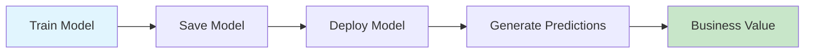
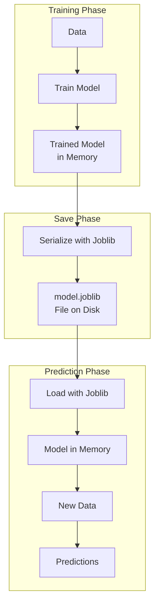
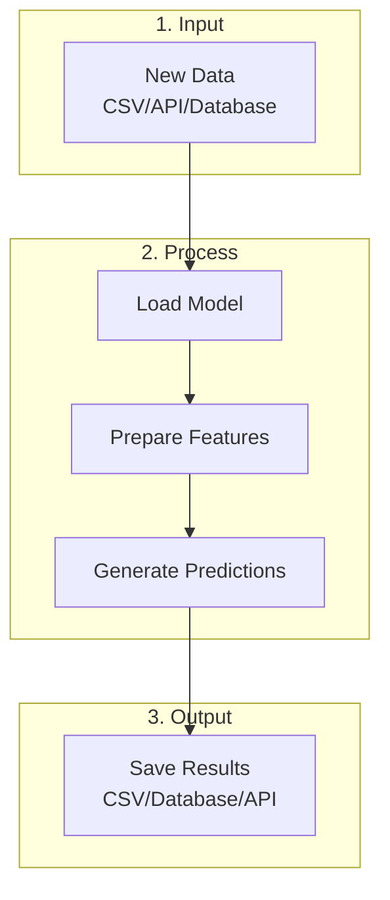
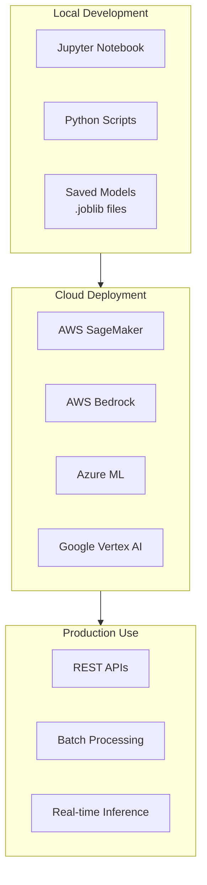
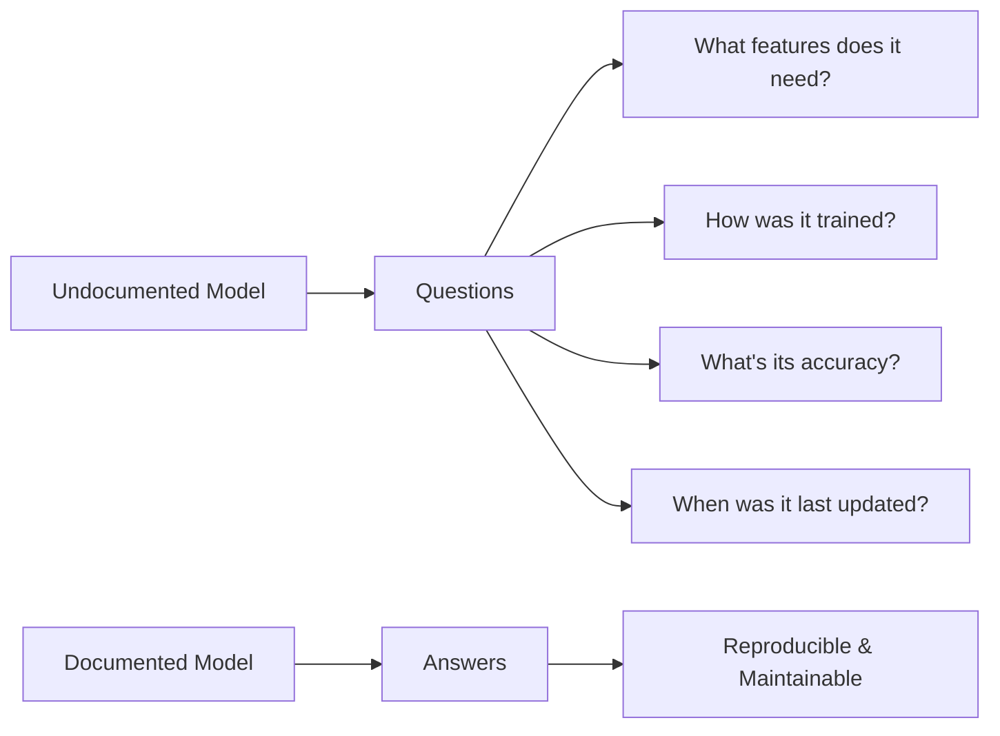
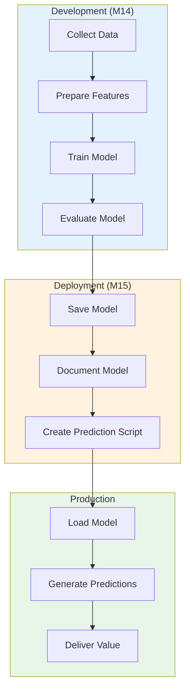
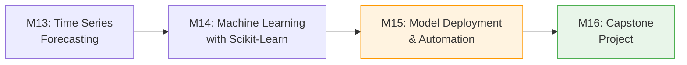

# Module 15 — Model Deployment and Automation

**Session Time:** 120 minutes

---

## Prerequisites

- Python fundamentals (functions, file I/O)
- Working with Pandas DataFrames and NumPy arrays
- Training and evaluating machine learning models with Scikit-Learn
- Understanding of train-test split and evaluation metrics (RMSE, Accuracy)
- Completion of **Module 14 — Introduction to Machine Learning with Scikit-Learn**

---

## Session Breakdown

| Segment | Topic                                                | Duration (minutes) |
|--------:|------------------------------------------------------|--------------------|
| 1       | Why Model Deployment Matters                         | 10                 |
| 2       | Saving and Loading Models with Joblib                | 30                 |
| 3       | Building a Prediction Pipeline                       | 20                 |
| 4       | Introduction to Cloud AI Deployment Tools            | 20                 |
| 5       | Documenting Models for Reproducibility               | 10                 |
|         | **Lab — Saving and Loading Models for Automation**   | **30**             |

---

## Learning Objectives

By the end of this module, you'll be able to:

- Save trained models and load them for prediction within Python scripts
- Demonstrate awareness of AI deployment tools such as AWS Bedrock or SageMaker
- Document model outputs and reproducibility steps in markdown

---

## Tools

- Python 3
- Jupyter Notebook
- Scikit-Learn
- Joblib
- Pandas
- NumPy
- Git / GitHub

---

## Module Overview

Automate and document model deployment by saving, loading, and generating predictions within Python scripts using reproducible workflows.

---

## What You Will Learn

In this module, you transition from **building models** to **deploying models** — making them available for real-world use.

In Module 14, you trained and evaluated baseline machine learning models. But a model that only exists in a Jupyter Notebook cannot make predictions in production systems.

You will learn how to:

- Save trained models to files for later use
- Load saved models and generate predictions on new data
- Understand the landscape of cloud AI deployment tools
- Document your model workflow for reproducibility and collaboration

This is the final content module before your Capstone Project. The skills you learn here will help you deliver a complete, professional analytical solution.

---

## Why Model Deployment Matters

### The Gap Between Training and Production

Training a model is only the first step. To create real value, models must be:



### What is Model Deployment?

Model deployment is the process of making a trained machine learning model available for use in a production environment.

| Stage | Description | Example |
|-------|-------------|---------|
| **Development** | Train and evaluate model in notebook | Jupyter Notebook |
| **Serialization** | Save model to a file | `.joblib` or `.pkl` file |
| **Deployment** | Make model accessible | API, web service, batch script |
| **Inference** | Generate predictions on new data | Real-time or scheduled |

### Why Save Models?

Without saving your model, you would need to retrain it every time you want to make predictions. This is:

- **Time-consuming** — Training can take minutes to hours
- **Resource-intensive** — Requires computational power
- **Non-reproducible** — Results may vary between training runs

> **Key Insight:** A saved model captures the learned patterns from your training data, allowing instant predictions without retraining.

---

## Saving and Loading Models with Joblib

### What is Model Serialization?

Serialization converts a Python object (like a trained model) into a format that can be stored on disk and later reconstructed.



### Why Joblib?

Scikit-Learn recommends **Joblib** for saving models because:

- Efficiently handles large NumPy arrays (common in ML models)
- Faster than Python's built-in `pickle` for numerical data
- Simple API with `dump()` and `load()` functions

### Saving a Model

```python
import joblib
from sklearn.linear_model import LinearRegression

# Train your model (from Module 14)
model = LinearRegression()
model.fit(X_train, y_train)

# Save the trained model
joblib.dump(model, 'models/revenue_model.joblib')

print("✅ Model saved to models/revenue_model.joblib")
```

### Loading a Model

```python
import joblib

# Load the saved model
loaded_model = joblib.load('models/revenue_model.joblib')

# Make predictions with the loaded model
predictions = loaded_model.predict(X_new)

print("✅ Model loaded and ready for predictions")
```

### Complete Save/Load Example

```python
import joblib
import pandas as pd
from sklearn.model_selection import train_test_split
from sklearn.linear_model import LinearRegression
from sklearn.metrics import mean_squared_error
import numpy as np

# ========== TRAINING SCRIPT ==========
# 1. Load and prepare data
df = pd.read_csv('data/validated_dataset.csv')
X = df[['price_usd', 'discount_pct', 'marketing_spend_usd', 'units_sold']]
y = df['revenue_usd']

# 2. Split data
X_train, X_test, y_train, y_test = train_test_split(
    X, y, test_size=0.2, random_state=42
)

# 3. Train model
model = LinearRegression()
model.fit(X_train, y_train)

# 4. Evaluate
y_pred = model.predict(X_test)
rmse = np.sqrt(mean_squared_error(y_test, y_pred))
print(f"Test RMSE: ${rmse:,.2f}")

# 5. Save model
joblib.dump(model, 'models/revenue_model.joblib')
print("✅ Model saved!")

# ========== PREDICTION SCRIPT ==========
# Later, in a different script or session...

# 1. Load the saved model
model = joblib.load('models/revenue_model.joblib')

# 2. Prepare new data for prediction
new_data = pd.DataFrame({
    'price_usd': [49.99, 79.00, 120.00],
    'discount_pct': [0.10, 0.15, 0.05],
    'marketing_spend_usd': [100, 150, 200],
    'units_sold': [10, 15, 8]
})

# 3. Generate predictions
predictions = model.predict(new_data)

# 4. Display results
for i, pred in enumerate(predictions):
    print(f"Product {i+1}: Predicted Revenue = ${pred:,.2f}")
```

### Best Practices for Saving Models

| Practice | Why It Matters |
|----------|---------------|
| Use descriptive filenames | `revenue_model_v1.joblib` not `model.joblib` |
| Include version numbers | Track model iterations |
| Store in dedicated folder | Keep models organized (`models/`) |
| Save alongside metadata | Record training date, metrics, features used |

---

## Building a Prediction Pipeline

### From Notebook to Script

In production, models typically run as Python scripts, not Jupyter Notebooks. This enables:

- **Automation** — Schedule predictions to run automatically
- **Integration** — Connect with other systems and workflows
- **Scalability** — Process large volumes of data

### The Prediction Pipeline Pattern



### Example: Batch Prediction Script

Create a standalone Python script (`predict.py`) that can be run from the command line:

```python
"""
predict.py - Batch prediction script
Usage: python predict.py input.csv output.csv
"""

import sys
import joblib
import pandas as pd
from datetime import datetime

def load_model(model_path='models/revenue_model.joblib'):
    """Load the trained model from disk."""
    print(f"📦 Loading model from {model_path}...")
    model = joblib.load(model_path)
    print("✅ Model loaded successfully!")
    return model

def prepare_features(df, feature_cols):
    """Select and validate required features."""
    missing = set(feature_cols) - set(df.columns)
    if missing:
        raise ValueError(f"Missing columns: {missing}")
    return df[feature_cols]

def generate_predictions(model, X):
    """Generate predictions using the loaded model."""
    predictions = model.predict(X)
    return predictions

def save_results(df, predictions, output_path):
    """Save predictions to CSV."""
    df = df.copy()
    df['predicted_revenue'] = predictions
    df['prediction_timestamp'] = datetime.now().isoformat()
    df.to_csv(output_path, index=False)
    print(f"✅ Results saved to {output_path}")

def main(input_path, output_path):
    """Main prediction pipeline."""
    # Configuration
    FEATURE_COLS = ['price_usd', 'discount_pct', 'marketing_spend_usd', 'units_sold']
    MODEL_PATH = 'models/revenue_model.joblib'
    
    # 1. Load data
    print(f"📄 Loading data from {input_path}...")
    df = pd.read_csv(input_path)
    print(f"   Found {len(df)} records")
    
    # 2. Load model
    model = load_model(MODEL_PATH)
    
    # 3. Prepare features
    X = prepare_features(df, FEATURE_COLS)
    
    # 4. Generate predictions
    print("🔮 Generating predictions...")
    predictions = generate_predictions(model, X)
    
    # 5. Save results
    save_results(df, predictions, output_path)
    
    print("🎉 Prediction pipeline complete!")

if __name__ == "__main__":
    if len(sys.argv) != 3:
        print("Usage: python predict.py <input.csv> <output.csv>")
        sys.exit(1)
    
    main(sys.argv[1], sys.argv[2])
```

### Running the Script

```bash
# From the command line
python predict.py data/new_products.csv outputs/predictions.csv
```

### Handling Feature Consistency

A critical issue in deployment: **the model expects the same features it was trained on**.

```python
# Save feature information alongside the model
model_info = {
    'model': model,
    'feature_names': ['price_usd', 'discount_pct', 'marketing_spend_usd', 'units_sold'],
    'target_name': 'revenue_usd',
    'training_date': '2025-01-27',
    'rmse': 1234.56
}

joblib.dump(model_info, 'models/revenue_model_with_metadata.joblib')

# Load and use
model_info = joblib.load('models/revenue_model_with_metadata.joblib')
model = model_info['model']
features = model_info['feature_names']
```

---

## Introduction to Cloud AI Deployment Tools

### Beyond Local Deployment

While saving models locally works for learning and small projects, enterprise applications require:

- **Scalability** — Handle thousands of prediction requests
- **Availability** — 24/7 uptime with automatic failover
- **Management** — Version control, monitoring, A/B testing
- **Security** — Authentication, encryption, access control

### The Cloud AI Landscape



### AWS SageMaker — Overview

**Amazon SageMaker** is a fully managed machine learning service that provides:

| Feature | Description |
|---------|-------------|
| **Build** | Jupyter notebooks in the cloud |
| **Train** | Managed training infrastructure |
| **Deploy** | One-click model deployment to endpoints |
| **Monitor** | Track model performance over time |

**Basic SageMaker Workflow:**

```python
# Conceptual example (requires AWS account and configuration)
import sagemaker
from sagemaker.sklearn import SKLearnModel

# 1. Upload model to S3
model_data = 's3://my-bucket/models/revenue_model.tar.gz'

# 2. Create SageMaker model
sklearn_model = SKLearnModel(
    model_data=model_data,
    role='arn:aws:iam::123456789:role/SageMakerRole',
    framework_version='1.0-1',
    py_version='py3'
)

# 3. Deploy to endpoint
predictor = sklearn_model.deploy(
    instance_type='ml.t2.medium',
    initial_instance_count=1
)

# 4. Make predictions via API
result = predictor.predict([[49.99, 0.10, 100, 10]])
```

### AWS Bedrock — Overview

**Amazon Bedrock** is a service for building generative AI applications using foundation models:

| Feature | Description |
|---------|-------------|
| **Foundation Models** | Access to Claude, Llama, Titan, and more |
| **No Infrastructure** | Serverless, pay-per-use |
| **Customization** | Fine-tune models on your data |
| **Integration** | Easy API-based access |

**Note:** Bedrock is primarily for generative AI (text, images), while SageMaker is for custom ML models like the ones you've built in this course.

### When to Use What?

| Scenario | Recommended Tool |
|----------|-----------------|
| Learning and prototyping | Local (Joblib) |
| Small-scale batch predictions | Python scripts |
| Production web application | SageMaker Endpoint |
| Text generation, summarization | Bedrock |
| Large-scale batch processing | SageMaker Batch Transform |

### Key Awareness Points

For this course, you should understand:

1. **Local deployment** (Joblib) is sufficient for learning and small projects
2. **Cloud services** exist for production-scale deployment
3. **APIs** are the common interface for deployed models
4. **Documentation** is essential for any deployment approach

> **Note:** Hands-on cloud deployment requires AWS account setup and is beyond this course's scope. Focus on understanding the concepts and mastering local deployment.

---

## Documenting Models for Reproducibility

### Why Documentation Matters

A model without documentation is like code without comments — usable today, mysterious tomorrow.



### What to Document

#### 1. Model Card (Recommended Format)

A **Model Card** is a standardized document describing a machine learning model:

```markdown
# Model Card: Revenue Prediction Model

## Model Details
- **Model Type:** Linear Regression
- **Framework:** Scikit-Learn 1.3.0
- **Training Date:** 2025-01-27
- **Author:** Data Analytics Team

## Intended Use
- **Primary Use:** Predict product revenue based on pricing and marketing features
- **Users:** Business analysts, marketing team
- **Out-of-Scope:** Not suitable for luxury products (>$1000)

## Training Data
- **Source:** validated_dataset_m14.csv
- **Size:** 366 records
- **Date Range:** 2025-01-01 to 2025-12-31
- **Features:** price_usd, discount_pct, marketing_spend_usd, units_sold

## Evaluation Metrics
- **RMSE:** $1,234.56
- **MAE:** $890.12
- **Test Set Size:** 20%

## Limitations
- Trained on limited data (1 year)
- May underperform on seasonal patterns
- Does not account for competitor pricing

## Version History
| Version | Date | Changes |
|---------|------|---------|
| 1.0 | 2025-01-27 | Initial release |
```

#### 2. Code Documentation

```python
"""
Revenue Prediction Model
========================

This module provides functions for loading and using the revenue prediction model.

Model Information:
- Type: Linear Regression (sklearn.linear_model.LinearRegression)
- Input Features: price_usd, discount_pct, marketing_spend_usd, units_sold
- Output: Predicted revenue in USD

Example Usage:
    >>> from predict import load_model, predict_revenue
    >>> model = load_model('models/revenue_model.joblib')
    >>> prediction = predict_revenue(model, price=49.99, discount=0.1, 
    ...                               marketing=100, units=10)
    >>> print(f"Predicted revenue: ${prediction:.2f}")

Author: Your Name
Date: 2025-01-27
Version: 1.0
"""
```

#### 3. Requirements File

Track your environment for reproducibility:

```text
# requirements.txt
pandas==2.0.0
numpy==1.24.0
scikit-learn==1.3.0
joblib==1.3.0
matplotlib==3.7.0
```

Generate automatically:
```bash
pip freeze > requirements.txt
```

### The Complete Model Package

A well-documented model deployment includes:

```
model_package/
│
├── models/
│   └── revenue_model.joblib
│
├── src/
│   ├── train.py
│   └── predict.py
│
├── docs/
│   └── MODEL_CARD.md
│
├── notebooks/
│   └── model_development.ipynb
│
├── requirements.txt
├── README.md
└── .gitignore
```

---

## Putting It All Together

### The Complete ML Lifecycle



### Code Summary

```python
# =========================================
# COMPLETE WORKFLOW: Train → Save → Load → Predict
# =========================================

import joblib
import pandas as pd
import numpy as np
from sklearn.model_selection import train_test_split
from sklearn.linear_model import LinearRegression
from sklearn.metrics import mean_squared_error, mean_absolute_error
from datetime import datetime

# ---------- STEP 1: Train and Save ----------

# Load data
df = pd.read_csv('data/validated_dataset_m14.csv')

# Define features and target
feature_cols = ['price_usd', 'discount_pct', 'marketing_spend_usd', 'units_sold']
X = df[feature_cols]
y = df['revenue_usd']

# Split data
X_train, X_test, y_train, y_test = train_test_split(
    X, y, test_size=0.2, random_state=42
)

# Train model
model = LinearRegression()
model.fit(X_train, y_train)

# Evaluate
y_pred = model.predict(X_test)
rmse = np.sqrt(mean_squared_error(y_test, y_pred))
mae = mean_absolute_error(y_test, y_pred)

print(f"📊 Model Performance:")
print(f"   RMSE: ${rmse:,.2f}")
print(f"   MAE:  ${mae:,.2f}")

# Save model with metadata
model_package = {
    'model': model,
    'feature_names': feature_cols,
    'training_date': datetime.now().isoformat(),
    'metrics': {'rmse': rmse, 'mae': mae},
    'sklearn_version': '1.3.0'
}

joblib.dump(model_package, 'models/revenue_model_v1.joblib')
print("✅ Model saved to models/revenue_model_v1.joblib")

# ---------- STEP 2: Load and Predict ----------

# Load model package
loaded_package = joblib.load('models/revenue_model_v1.joblib')
model = loaded_package['model']
feature_names = loaded_package['feature_names']

print(f"\n📦 Loaded model trained on {loaded_package['training_date']}")
print(f"   Features: {feature_names}")

# New data for prediction
new_products = pd.DataFrame({
    'price_usd': [29.99, 59.99, 99.99],
    'discount_pct': [0.05, 0.10, 0.15],
    'marketing_spend_usd': [50, 100, 150],
    'units_sold': [20, 15, 10]
})

# Generate predictions
predictions = model.predict(new_products[feature_names])

# Display results
print("\n🔮 Predictions:")
for i, (_, row) in enumerate(new_products.iterrows()):
    print(f"   Product {i+1} (${row['price_usd']:.2f}): "
          f"Predicted Revenue = ${predictions[i]:,.2f}")
```

---

## Connection to Previous Modules

### Your Learning Journey



| Module | Focus | Key Skills |
|--------|-------|------------|
| **M13** | Time Series | Forecasting, rolling averages, MAE/RMSE |
| **M14** | Machine Learning | Train-test split, baseline models, evaluation |
| **M15** | Deployment | Save/load models, automation, documentation |
| **M16** | Capstone | Integrate all skills in a complete project |

### Skills You'll Apply in the Capstone

After completing this module, you have all the technical skills needed for your Capstone Project:

- ✅ Data loading and cleaning (M1-M8)
- ✅ Exploratory data analysis (M9-M10)
- ✅ Statistical analysis (M11-M12)
- ✅ Time series analysis (M13)
- ✅ Machine learning (M14)
- ✅ Model deployment and documentation (M15)

---

## AI Reflection Prompt

Before starting the lab, use an AI assistant of your choice and ask:

> "What are the key considerations when deploying a machine learning model from a Jupyter Notebook to a production environment?"

As you review the response, reflect on:

- The difference between development and production environments
- Why documentation is crucial for deployed models
- How version control helps manage model updates
- The role of monitoring in production systems

Keep these ideas in mind as you save and document your model in the lab.

---

## Wrap-Up Reflection

- Why is it important to save models rather than retrain them each time?
- What information should be documented alongside a saved model?
- How do cloud deployment tools differ from local deployment?
- What challenges might arise when a model is deployed to production?
- How will you apply these deployment concepts in your Capstone Project?

---

## Resources

- **Scikit-Learn: Model Persistence**  
  https://scikit-learn.org/stable/model_persistence.html

- **Joblib Documentation**  
  https://joblib.readthedocs.io/

- **AWS SageMaker Developer Guide**  
  https://docs.aws.amazon.com/sagemaker/latest/dg/whatis.html

- **AWS Bedrock Overview**  
  https://aws.amazon.com/bedrock/

- **Model Cards for Model Reporting (Google)**  
  https://modelcards.withgoogle.com/about

- **ML Ops: Machine Learning Operations**  
  https://ml-ops.org/

---

## What's Next?

🎯 **Module 16 — Capstone Project**

In the final module, you will integrate all the skills from this course into a complete, end-to-end data analytics project. You will:

- Define a business problem
- Collect and clean data
- Perform exploratory analysis
- Build and evaluate a predictive model
- Save and document your model
- Present your findings in a reproducible GitHub repository

The skills you learned in this module — saving models, creating prediction pipelines, and documenting your work — will be essential for delivering a professional-quality capstone project.

**Good luck! 🚀**
