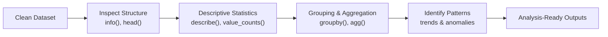

# Module 6 — Exploratory Data Analysis with Pandas

**Session Time:** 120 minutes

---

## Prerequisites

- Python fundamentals (variables, conditionals, functions)
- NumPy basics (arrays, vectorised operations)
- Pandas fundamentals (loading, cleaning, transforming data)
- Completion of **Module 5 — Pandas Fundamentals: Data Wrangling**

---

## Session Breakdown

| Segment | Topic                                      | Duration (minutes) |
|--------:|--------------------------------------------|--------------------|
| 1       | Introduction to Exploratory Data Analysis  | 10                 |
| 2       | Descriptive Statistics with Pandas         | 20                 |
| 3       | Grouping and Aggregation                   | 20                 |
| 4       | Identifying Patterns and Anomalies         | 20                 |
| 5       | Preparing Data for Downstream Analysis     | 10                 |
| 6       | Wrap-Up Reflection & Discussion            | 10                 |
|         | **Lab — Optimising Calculations with NumPy Arrays**| **30**     |

---
## Learning Objectives

By the end of this module, you'll be able to:

- Perform exploratory data analysis using Pandas DataFrames  
- Calculate and interpret descriptive statistics  
- Group and aggregate data to answer analytical questions  
- Identify trends, patterns, and potential anomalies  
- Prepare analysis-ready outputs for downstream tasks  

---

## What You Will Learn

In this module, you move from **clean data** to **insight-ready data**.

You’ll use Pandas to explore datasets, summarise information, and build intuition about what the data is telling you before moving into visualisation, statistical testing, or modelling.

Exploratory Data Analysis (EDA) is a critical step in analytics workflows because it helps you:

- Validate assumptions  
- Detect unexpected behaviour in the data  
- Decide what questions to ask next  
- Reduce errors later in the analysis pipeline  

---
## Introduction to Exploratory Data Analysis (EDA)

Exploratory Data Analysis focuses on **understanding your dataset before drawing conclusions**.

EDA helps you answer questions such as:

- What does “typical” look like in this dataset?
- Are there extreme or unusual values?
- How do different groups compare?
- Does the data behave as expected?

Rather than producing final answers, EDA is about **developing analytical understanding**.

### Conceptual EDA Workflow

---
## Descriptive Statistics with Pandas

Descriptive statistics provide numerical summaries of your data.

Common methods include:

- `df.describe()` — summary statistics for numeric columns  
- `df.mean()`, `df.median()`, `df.std()` — measures of central tendency and spread  
- `df.value_counts()` — frequency counts for categorical data  

These statistics help you understand:

- Typical values  
- Variability  
- Distribution ranges  

They are often the first signal of potential issues or early insights in your dataset.

---
## Grouping and Aggregation

Grouping allows you to compare subsets of data and answer targeted analytical questions.

Using `groupby()`, you can:

- Segment data by category  
- Compute aggregated metrics per group  
- Compare behaviour across different segments  

Examples include:

- Average sales per region  
- Total revenue by product category  
- Counts per customer type  

Grouping transforms row-level data into higher-level summaries that reveal patterns and differences across groups.

---
## Identifying Patterns and Anomalies

Once data is summarised, interpretation becomes key.

During exploratory data analysis, look for:

- Unexpected values or ranges  
- Large differences between groups  
- Trends that warrant further investigation  
- Signals that data quality issues may still exist  

These observations guide decisions about:

- Additional cleaning steps  
- Visualisation priorities  
- Feature selection for modelling  

EDA helps you move from *numbers* to *insight* by highlighting what deserves deeper attention.

---

## Preparing Data for Downstream Analysis

Exploratory Data Analysis is not an endpoint — it prepares data for what comes next.

After exploratory analysis, datasets are often:

- Filtered to relevant records  
- Aggregated at the appropriate level  
- Saved for reuse in visualisation, statistical analysis, or modelling  

Saving analysis-ready outputs ensures your work is:

- Reproducible  
- Transparent  
- Easy to build upon in later stages of the analytics pipeline

---
> ### Optional AI Reflection Prompt
> Using an AI assistant of your choice, ask:
> *“Given this EDA workflow, what types of questions should an analyst ask before visualising or modelling the data?”*
>
> Use the response to reflect on your own analytical approach. Do not copy answers directly into assessments.

## Wrap-Up Reflection

- Why is exploratory analysis essential before visualisation or modelling?
- How can summary statistics be misleading if taken out of context?
- What insights can grouping reveal that raw data alone cannot?

---

## Resources

- **Pandas Documentation**  
  https://pandas.pydata.org/docs/

- **Pandas User Guide — GroupBy**  
  https://pandas.pydata.org/docs/user_guide/groupby.html

- **Pandas User Guide — Descriptive Statistics**  
  https://pandas.pydata.org/docs/user_guide/basics.html#descriptive-statistics

- **Real Python — Exploratory Data Analysis with Pandas**  
  https://realpython.com/pandas-python-explore-dataset/

