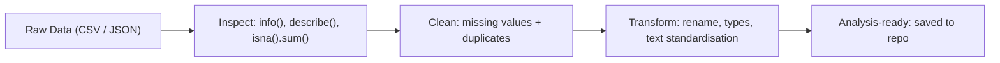

# Module 5 — Pandas Fundamentals: Data Wrangling

## Module Overview

In this module, you will learn how to **clean, transform, and prepare real-world datasets** using **Pandas DataFrames**.

Data rarely arrives in a clean, analysis-ready format. You will practise structured data-wrangling techniques to handle missing values, duplicates, and inconsistent formats — producing a dataset that can be confidently used for analysis, modelling, or visualisation.

This module focuses on **practical, repeatable cleaning workflows** that mirror how data is prepared in real analytics projects.

---

## Learning Objectives

By the end of this module, you will be able to:

- Load datasets into Pandas DataFrames
- Inspect and understand data structure and quality
- Handle missing values using appropriate strategies
- Remove duplicate records
- Standardise data formats and column values
- Produce a clean, analysis-ready dataset
- Save cleaned data to a project repository in a reproducible way

---

## Tools and Technologies

- Python 3  
- Jupyter Notebook  
- Pandas  
- Git  
- GitHub  

---

## Session Breakdown

| Segment | Topic | Duration (minutes) |
|------|------|------|
| 1 | Introduction to Data Wrangling with Pandas | 15 |
| 2 | Inspecting DataFrames and Data Quality | 20 |
| 3 | Handling Missing Data and Duplicates | 20 |
| 4 | Transforming and Standardising Data | 25 |
| 5 | Preparing Data for Analysis + Lab Preview | 10 |
|   | **Lab — Cleaning and Transforming Data in Pandas**| **30** |

---

## 1. Introduction to Pandas DataFrames

Pandas is the core Python library for **tabular data manipulation**.

A **DataFrame** represents data organised into rows and columns, similar to a spreadsheet or SQL table.

```python
import pandas as pd

df = pd.read_csv("data/raw/sample_data.csv")
df.head()
```
DataFrames allow you to:

- Filter rows and columns
- Apply transformations
- Handle missing values
- Aggregate and summarise data
- Export analysis-ready dataset

---

## 2. Inspecting Data Quality

Before cleaning data, it’s essential to understand its structure and issues.

Common inspection methods include:

```python
df.info()
df.describe()
df.isna().sum()
```
These checks help you identify:

- Missing values  
- Unexpected data types  
- Outliers  
- Duplicate rows  

---

## 3. Handling Missing Data and Duplicates

Real datasets often contain incomplete or repeated information.

Common strategies include:

- Removing rows with missing values  
- Filling missing values with summary statistics (mean, median, or mode)  
- Forward or backward filling  
- Removing duplicate records  

Example cleaning steps in Pandas:

```python
df = df.drop_duplicates()
df = df.fillna(df.mean(numeric_only=True))
```
Choosing the right cleaning strategy depends on context, not a single rule.

---

## 4. Transforming and Standardising Data

Cleaning data often requires standardising formats and values so datasets are consistent and analysis-ready.

Common transformation tasks include:

- Renaming columns  
- Converting data types  
- Normalising text values  
- Creating derived columns  

Example transformations using Pandas:

```python
df.columns = df.columns.str.lower()
df["category"] = df["category"].str.strip().str.lower()
```
### From Raw Data to Analysis-Ready Data

The goal of data wrangling is to move from raw, imperfect data to a clean, consistent dataset that can be confidently analysed.


Each step builds on the previous one to ensure your data is:

- Accurate  
- Consistent  
- Reproducible  
- Ready for downstream analysis

### Conceptual Overview — From Raw Data to Clean Data


This structured process helps ensure data is **reliable**, **interpretable**, and **reproducible**.

---

## 5. Saving Cleaned Data

Once your data is cleaned, it should be saved for reuse in later analysis stages.

```python
df.to_csv("data/processed/clean_data.csv", index=False)
```
Saving cleaned datasets ensures:

- Consistency across analyses
- Reproducibility of results
- Clear separation between raw and processed data
Separating **raw** and **processed** data ensures transparency, traceability, and reproducibility throughout your project.

---
> 💡 **Real-world note**  
> In practice, data cleaning often takes more time than analysis itself.  
> Well-documented cleaning steps save time and prevent errors later in the project.

## Lab Preview — Cleaning and Transforming Data in Pandas

In the lab that follows this module, you will:

- Load raw datasets into Pandas DataFrames  
- Inspect and assess data quality  
- Handle missing values and duplicates  
- Standardise and transform data formats  
- Save a cleaned dataset to the project repository  
- Document your cleaning decisions clearly  

This lab builds **applied data-wrangling skills** used across analytics, data science, and machine learning workflows.

---

## Wrap-Up Reflection

Consider the following questions:

- Why is data rarely analysis-ready when first loaded?  
- How do structured cleaning steps improve reliability?  
- Why should raw and cleaned data be kept separate?

---

## Resources

- **Pandas Documentation**  
  https://pandas.pydata.org/docs/

- **Pandas User Guide — Cleaning Data**  
  https://pandas.pydata.org/docs/user_guide/missing_data.html

- **Real Python — Pandas Tutorials**  
  https://realpython.com/pandas-dataframe/

- **GitHub Documentation**  
  https://docs.github.com
