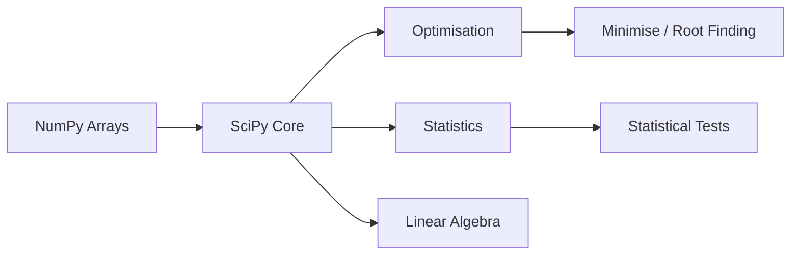

# Module 7 — Scientific Computing with SciPy

**Session Time:** 120 minutes

---

## Prerequisites

- Python fundamentals (functions, control flow)
- NumPy arrays and vectorised operations
- Exploratory Data Analysis with Pandas (Module 6)
- Comfort working in Jupyter Notebooks

---

## Session Breakdown

| Segment | Topic                                             | Duration (minutes) |
|--------:|---------------------------------------------------|--------------------|
| 1       | Introduction to Scientific Computing              | 10                 |
| 2       | Numerical Computation with SciPy                  | 20                 |
| 3       | Optimisation and Root Finding                     | 20                 |
| 4       | Statistical Analysis with SciPy                   | 20                 |
| 5       | Interpreting Results & Analytical Reasoning       | 10                 |
| 6       | Lab Overview & Transition                         | 10                 |
|         | **Lab — Scientific Computing with SciPy**         | **30**             |

---

## Learning Objectives

By the end of this module, you'll be able to:

- Apply SciPy functions for numerical and scientific computation  
- Solve optimisation and root-finding problems programmatically  
- Perform statistical tests using SciPy  
- Interpret numerical and statistical results in context  
- Select appropriate scientific computing tools for analytical tasks  

---

## What You Will Learn

This module introduces **SciPy**, a core library for **scientific and numerical computing** in Python.

While NumPy focuses on fast array operations, **SciPy builds on NumPy** to provide higher-level tools for:

- Mathematical optimisation  
- Statistical analysis  
- Scientific modelling  
- Numerical problem-solving  

SciPy is commonly used in data science, engineering, research, and machine learning pipelines where **precision, performance, and reproducibility** matter.

---

## Introduction to Scientific Computing

Scientific computing involves **using mathematical models and numerical methods** to solve real-world problems.

Examples include:

- Finding optimal solutions under constraints  
- Estimating probabilities and distributions  
- Solving equations that cannot be expressed analytically  

SciPy provides reliable, well-tested implementations of these methods so analysts can focus on **interpretation**, not reinventing algorithms.

---

## SciPy Ecosystem Overview

SciPy modules are organised by domain, making it easier to select the right tool for each analytical task.

---

## Numerical Computation with SciPy

SciPy provides numerical routines for problems that go beyond basic arithmetic.

Common use cases include:

- Solving systems of equations  
- Interpolating data  
- Computing numerical integrals  

These tools allow you to **approximate solutions** when exact solutions are impractical or impossible.

---

## Optimisation and Root Finding

Optimisation focuses on **finding the best solution** given a defined objective.

With SciPy, you can:

- Minimise or maximise functions  
- Apply constraints to optimisation problems  
- Find roots (zeros) of equations  

Typical applications include:

- Cost minimisation  
- Parameter tuning  
- Scientific model calibration  

---

## Statistical Analysis with SciPy

SciPy includes a rich set of statistical tools for **inference and hypothesis testing**.

You can use SciPy to:

- Work with probability distributions  
- Run statistical tests (e.g. t-tests)  
- Compare samples and validate assumptions  

These techniques help move from **descriptive analysis** to **statistical reasoning**.

---

## Interpreting Results and Analytical Reasoning

Scientific computing is not just about obtaining numbers — it’s about **interpreting them responsibly**.

When using SciPy, always consider:

- Assumptions behind each method  
- Sensitivity of results to inputs  
- Whether numerical results make sense in context  

Clear interpretation is essential for **trustworthy analysis**.

---

## Optional AI Reflection Prompt

Using an AI assistant of your choice, ask:

> **“When should an analyst prefer numerical optimisation over analytical solutions?”**

Use the response to reflect on the **strengths and limitations** of scientific computing approaches.

---

## Wrap-Up Reflection

- How does SciPy extend NumPy’s capabilities?  
- Why is optimisation a common task in data-driven projects?  
- What risks arise when statistical tests are applied without understanding assumptions?  

---

## Resources

- **SciPy Documentation**  
  https://docs.scipy.org/doc/scipy/

- **SciPy Tutorial**  
  https://docs.scipy.org/doc/scipy/tutorial/

- **NumPy vs SciPy Overview**  
  https://numpy.org/doc/stable/user/numpy-for-matlab-users.html

- **Real Python — SciPy Guide**  
  https://realpython.com/python-scipy/

