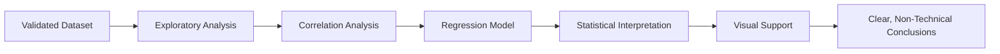

# Module 11 — Statistical Analysis and Inference

**Session Time:** 120 minutes

---

## Prerequisites

- Python fundamentals (functions, conditionals)
- Working with Pandas DataFrames
- Exploratory Data Analysis (EDA)
- Data validation and quality assurance practices
- Completion of **Module 10 — Exploring Relationships: Correlation & Regression Analysis**

---

## Session Breakdown

| Segment | Topic                                                   | Duration (minutes) |
|-------:|---------------------------------------------------------|--------------------|
| 1      | From Exploration to Statistical Inference               | 10                 |
| 2      | Correlation Analysis in Practice                         | 20                 |
| 3      | Introduction to Regression Models                        | 25                 |
| 4      | Interpreting Coefficients and Significance               | 25                 |
| 5      | Communicating Results to Non-Technical Audiences         | 10                 |
|        | **Lab — Statistical Analysis and Inference**             | **30**             |

---

## Learning Objectives

By the end of this module, you'll be able to:

- Perform **correlation and regression analyses** using Python statistical libraries  
- Interpret **coefficients, strength, and significance** of relationships  
- Distinguish between correlation, association, and explanatory modelling  
- Draw **data-driven conclusions** grounded in statistical evidence  
- Present findings clearly using **non-technical language**, visuals, and markdown  

---

## What You Will Learn

In this module, you move from **describing patterns** to **explaining relationships**.

After validating data (Module 9) and exploring trends (Module 10), analysts are ready to ask deeper questions such as:

- How strong is the relationship between variables?
- Is the relationship statistically meaningful or likely due to chance?
- How does one variable change in relation to another?
- What conclusions can (and cannot) be drawn from the analysis?

You will learn how to **apply statistical methods responsibly**, interpret results, and communicate insights with clarity and caution.

---

## From Exploration to Inference

Exploratory analysis helps you *see* patterns.  
Statistical analysis helps you *test and explain* them.

This module introduces formal techniques that allow analysts to:

- Quantify relationships  
- Assess uncertainty  
- Avoid over-interpreting random variation  

The goal is not prediction, but **sound analytical reasoning**.

---

## Correlation Analysis

Correlation measures the **strength and direction** of a relationship between variables.

Using Python, you will:

- Compute correlation coefficients (e.g. Pearson correlation)
- Compare relationships across multiple variables
- Identify positive, negative, or weak associations

Important reminders:

- Correlation does **not** imply causation  
- Strong correlation does not guarantee meaningful insight  
- Context always matters  

Correlation is a **starting point**, not a conclusion.

---

## Regression Analysis

Regression analysis provides a structured way to **explain relationships** between variables.

In this module, you will focus on:

- Simple linear regression concepts  
- Independent vs dependent variables  
- Interpreting regression coefficients  
- Understanding significance and model limitations  

Regression helps answer questions such as:

> “How does a change in one variable relate to changes in another, on average?”

---

## Interpreting Coefficients and Significance

Statistical outputs require careful interpretation.

You will learn to:

- Interpret regression coefficients in plain language  
- Understand statistical significance conceptually  
- Recognise the difference between statistical and practical significance  
- Avoid common pitfalls such as overconfidence in models  

Good analysis balances **numbers, reasoning, and judgement**.

---

## Communicating Insights Clearly

Statistical results are only valuable if they can be understood.

This module emphasises:

- Translating results into non-technical explanations  
- Using visuals to support interpretation  
- Clearly stating assumptions and limitations  
- Writing concise analytical summaries in markdown  

Clear communication builds trust and supports better decision-making.

---

## Conceptual Statistical Analysis Workflow

## AI Reflection Prompt

Before starting the lab, use an AI assistant of your choice and ask:

> **“When is correlation analysis insufficient, and why might regression provide deeper insight?”**

As you review the response, reflect on:

- What kinds of questions correlation can answer  
- What additional insight regression might provide  
- The risks of over-interpreting relationships  
- How analytical context influences interpretation  

Keep these reflections in mind as you design and interpret your statistical analysis in the lab.

---

## Wrap-Up Reflection

- Why is validated data essential before correlation or regression analysis?  
- How can visual exploration support or challenge statistical results?  
- What are the risks of misinterpreting correlation or regression outputs?  
- How does clear documentation improve analytical credibility?  

---

## Resources

- **Pandas Documentation**  
  https://pandas.pydata.org/docs/

- **SciPy Documentation**  
  https://docs.scipy.org/doc/scipy/

- **StatsModels Documentation**  
  https://www.statsmodels.org/stable/index.html

- **Correlation and Regression (Conceptual Overview)**  
  https://www.statisticshowto.com/probability-and-statistics/correlation-analysis/

- **Real Python — Correlation & Regression with Pandas**  
  https://realpython.com/pandas-correlation-regression/
